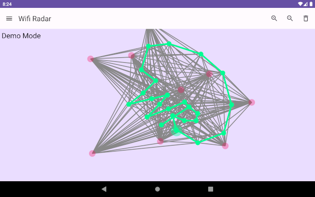

# Wifi Radar

Wifi Radar is (experimental) application to scan WiFi access points and create map about those.

Other purpose for this application is to learn more Kotlin, Jetpack Compose and Android application development.

## Documentation

Development related instructions are in this README.md file.

Algorithm descriptions etc. are in [docs/index.md](docs/index.md) file, which is also public web page for this app.

## Crashlytics setup

[Crashlytics](https://firebase.google.com/products/crashlytics) could help investigating possible crash bugs.

There are two options, with or without Crashlytics. Both options require some preparations.

Build with Crashlytics:
- Create own Crashlytics project
- get `google-services.json` from Crashlytics and add it to `app` directory

Build without Crashlytics:
- Comment out following two lines from `plugin` section from `app/build.gradle`

      id 'com.google.gms.google-services'
      id 'com.google.firebase.crashlytics'

## Compile and install

Create `keystore.properties` file to project root to contain keystore parameters.

    storePassword=MyKeyStorePassword
    keyPassword=MyKeyPassword
    keyAlias=upload
    storeFile=MyKeyStoreFile

Build release apk file

    ./gradlew clean test assembleRelease

Or Build bundle files

    ./gradlew clean test bundle

## TODO list

Here is list of ideas what to do

- Functionality
  - calculation in coroutine?
  - Canvas
    - add automatic centering and scaling (pinch zoom?)
  - BT scanning
  - more advanced methods for getting distance
    - https://developer.android.com/guide/topics/connectivity/wifi-rtt
    - https://github.com/Plinzen/android-rttmanager-sample
  - simulation mode (if no permissions or if user want to just learn possibilities)
  - storing should work also over configuration changes (orientation changes)
  - pinch zoom
  - better file write and read, feasible for end user use
  - smart scanning when OS prevent to scan too often (notice OS initiated scans)

- Application
  - support for different languages (en, fi)
    - https://developer.android.com/guide/topics/resources/localization
  - publish to play store
  - compose testing?
    - https://developer.android.com/jetpack/compose/testing
